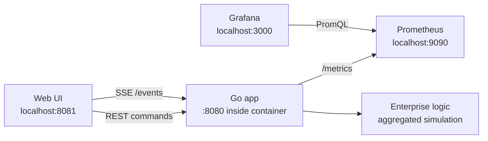

# Miners REST API

**_управляемая симуляция угольного предприятия на Go_**

<p align="center">
  
  
  
  
  
</p>

---

## Что это

Miners REST API - учебный backend-проект на Go, который симулирует работу небольшого угольного предприятия. Приложение запускает предприятие, начисляет пассивную добычу угля, позволяет нанимать шахтеров разных классов, покупать оборудование, смотреть текущее состояние, останавливать запуск предприятия и стартовать новую симуляцию без перезапуска контейнера.

Проект уже не требует ручного дергания API через Postman или curl: вместе с backend поднимается встроенный web UI. В браузере можно видеть баланс, активных шахтеров, статистику найма, оборудование, цель покупки всего оборудования, Grafana/Prometheus-ссылки и кнопки управления запуском. Для живого обновления интерфейс использует SSE-поток `/events`, а для мониторинга приложение отдает Prometheus-метрики на `/metrics`.

---

## Возможности

Проект умеет запускать и останавливать симуляцию предприятия, перезапускать предприятие после shutdown, нанимать шахтеров классов `weak`, `normal` и `strong`, покупать оборудование по цепочке целей от налобного фонаря до шахтного промышленного комплекса за 50 млн угля, показывать preview активной смены, отдавать полную и легкую сводку состояния, стримить live-события в UI через Server-Sent Events, экспортировать Prometheus-метрики и отображать готовый dashboard в Grafana.

Важная особенность текущей реализации - агрегированная симуляция шахтеров. При найме большого количества работников приложение не создает отдельную горутину на каждого шахтера. Вместо этого создается группа шахтеров одного класса, а один общий simulation loop раз в секунду обновляет группы и начисляет уголь пачками. Это заметно снижает нагрузку на CPU, память, HTTP API, Grafana и браузер.

---

## Стек

Backend написан на Go. HTTP-роутинг сделан через `github.com/gorilla/mux`. Frontend - это обычные статические `HTML/CSS/JS` файлы без отдельной сборки, которые встраиваются в Go binary через `embed`. Метрики собираются через `github.com/prometheus/client_golang`. Prometheus забирает метрики с `/metrics`, а Grafana автоматически получает datasource и dashboard через provisioning-файлы из директории `monitoring`.

Инфраструктурно проект запускается через Docker Compose. Compose поднимает три сервиса: `app`, `prometheus` и `grafana`. Сервис `app` собирается из локального `Dockerfile`, а Prometheus и Grafana используют официальные образы.

---

## Архитектура



`cmd/app` создает enterprise-состояние, запускает симуляцию и поднимает HTTP-сервер. Пакет `logic` отвечает за бизнес-правила: баланс, найм, покупку оборудования, shutdown/start и агрегированную добычу. Пакет `myHttp` содержит handlers, DTO, middleware, Prometheus collector, SSE endpoint и встроенный frontend. Пакет `internal` хранит доменные типы, классы шахтеров, параметры добычи и цены оборудования.

Web UI общается с backend двумя способами. Для команд вроде найма, покупки оборудования, остановки предприятия или завершения приложения используются обычные REST-запросы. Для live-обновления состояния используется `GET /events`: сервер держит SSE-соединение и раз в секунду отправляет актуальную легкую сводку предприятия.

---

## Порты

Внутри контейнера Go-приложение слушает `:8080`. На хост-машину оно проброшено как `8081`, поэтому в браузере нужно открывать `http://localhost:8081`. Prometheus доступен на `http://localhost:9090`, а Grafana - на `http://localhost:3000`.

Prometheus внутри Docker обращается к приложению не через `localhost:8081`, а по внутреннему compose-адресу `app:8080`. Это важно: `8081` нужен человеку на хост-машине, а `app:8080` нужен контейнерам внутри docker-сети.

---

## Запуск

Перед запуском убедитесь, что Docker Desktop открыт и Docker Engine работает. Затем из директории проекта выполните:

```bash
docker compose up --build --abort-on-container-exit
```

Этот вариант запуска удобен для связки `app + Prometheus + Grafana`: если приложение завершить через кнопку в web UI, контейнер `app` корректно остановится. Сам `app` дополнительно имеет healthcheck `/health` с интервалом `3s`, поэтому Prometheus и Grafana стартуют только после того, как backend действительно начал отвечать.

Если нужно запустить сервисы в фоне, используйте обычный detached-режим:

```bash
docker compose up --build -d
```

После запуска откройте web UI:

```text
http://localhost:8081
```

Grafana доступна по адресу:

```text
http://localhost:3000
```

Логин и пароль Grafana по умолчанию:

```text
admin / admin
```

Prometheus доступен по адресу:

```text
http://localhost:9090
```

Чтобы остановить весь compose-стек, выполните:

```bash
docker compose down
```

Кнопка завершения приложения в UI завершает весь локальный compose-стек. Для этого контейнер `app` получает доступ к Docker socket `/var/run/docker.sock`, находит контейнеры текущего compose-проекта по Docker labels, останавливает сервисы `prometheus` и `grafana`, а затем завершает собственный HTTP-сервер через graceful shutdown. Если приложение запущено не через Docker Compose или socket недоступен, кнопка все равно корректно завершит сам Go-сервис, но соседними контейнерами управлять не сможет.

---

## Запуск без Docker

Если нужен только Go backend и встроенный web UI без Prometheus/Grafana-контейнеров, можно запустить приложение напрямую:

```bash
go run ./cmd/app
```

В таком режиме приложение доступно на:

```text
http://localhost:8080
```

---

## Web UI

Основной способ пользоваться проектом - открыть `http://localhost:8081`. На странице есть карточки с балансом, количеством активных шахтеров, общей статистикой найма и состоянием запуска. В блоке найма можно выбрать класс шахтера и количество. В блоке оборудования можно покупать доступные предметы, если хватает угля. В блоке управления запуском можно остановить предприятие, запустить новую симуляцию после остановки и корректно завершить приложение.

Опасные действия подтверждаются через диалог: остановка предприятия и завершение приложения не выполняются случайным кликом. Цель в верхней панели показывает прогресс покупки оборудования в формате `0/18`, `1/18` и так далее до `18/18`, рядом отображается следующая покупка и ее цена. Когда все цели закрыты, интерфейс предлагает остановить предприятие и зафиксировать финальный результат, после чего можно начать новую игру. Активная смена отображается как preview: UI показывает общее количество активных шахтеров, но не пытается отрисовать десятки тысяч карточек в браузере.

---

## Игровая модель

Предприятие стартует с пассивной добычи: `+1` уголь каждые `2` секунды. Шахтеры делятся на три класса. `weak` стоит дешево, имеет небольшой запас энергии и добывает медленно. `normal` стоит дороже, работает быстрее и приносит больше угля. `strong` дорогой, но дает максимальную добычу и увеличивает добычу по мере рабочего цикла.

Оборудование покупается за накопленный уголь строго по порядку целей. Сначала предприятие закрывает базовую безопасность и ручной спуск: налобный фонарь, защитные перчатки, шахтерские ботинки, усиленная каска, усиленная кирка, респиратор, аптечка смены и датчик газа. Затем начинается инфраструктура шахты: рельсовый путь, вентиляция, вагонетка, гидравлический бур и грузовой подъемник. Финальная часть цепочки переводит предприятие в промышленный режим: диспетчерская, спасательная станция, линия сортировки угля, автоматизированный забой и шахтный промышленный комплекс за `50_000_000` угля. Покупки отражаются в JSON-ответах API, web UI и Prometheus-метрике `miners_equipment_owned`.

---

## API

`GET /miners/prices` возвращает параметры классов шахтеров. `POST /miners/hire?class=weak&count=3` нанимает шахтеров выбранного класса; `class` может быть `weak`, `normal` или `strong`, а `count` должен быть не меньше `1`. `GET /miners/active` возвращает активных шахтеров, а `GET /miners/active?limit=60` ограничивает размер ответа для preview.

`GET /equipment/prices` возвращает цены оборудования. `GET /equipment` показывает всю цепочку целей, порядковый номер каждой цели, описание, цену, флаг покупки, флаг следующей цели и возможность купить ее прямо сейчас. `POST /equipment/{type}/buy` покупает предмет оборудования, но перескакивать через цели нельзя: если предыдущие покупки не закрыты, API вернет ошибку.

`GET /enterprise/status` возвращает полный снимок предприятия. `GET /enterprise/summary` возвращает легкую сводку без большого списка шахтеров. `GET /events` открывает SSE-поток и отправляет live-сводку раз в секунду. `POST /enterprise/shutdown` останавливает предприятие и возвращает финальный отчет. `POST /enterprise/start` запускает новую симуляцию после остановки. `PUT /app/close` корректно завершает HTTP-сервер приложения.

Пример ручного сценария:

```bash
curl http://localhost:8081/enterprise/summary
curl http://localhost:8081/miners/prices
curl -X POST "http://localhost:8081/miners/hire?class=weak&count=1"
curl http://localhost:8081/miners/active?limit=10
curl -X POST http://localhost:8081/enterprise/shutdown
curl -X POST http://localhost:8081/enterprise/start
```

---

## Метрики и Grafana

Приложение отдает Prometheus-метрики на:

```text
http://localhost:8081/metrics
```

Prometheus собирает их раз в секунду по конфигурации из `monitoring/prometheus.yml`. Grafana автоматически подхватывает datasource и dashboard из `monitoring/grafana/provisioning` и `monitoring/grafana/dashboards`.

Основные прикладные метрики:

```text
miners_enterprise_balance
miners_active_total
miners_hired_total{class="weak|normal|strong"}
miners_equipment_owned{type="equipment_type"}
miners_http_requests_total
miners_http_request_duration_seconds
```

Помимо них экспортируются стандартные Go runtime и process-метрики: goroutines, heap, GC, CPU, file descriptors и другие показатели, которые добавляет Prometheus Go client.

---

## Структура проекта

```text
cmd/app                 точка входа приложения
internal                доменные типы, классы шахтеров, цены и конфигурация
logic                   бизнес-логика предприятия и агрегированная симуляция
myHttp                  HTTP handlers, DTO, middleware, metrics, SSE, static frontend
myHttp/static           встроенный web UI
monitoring/prometheus.yml
monitoring/grafana      provisioning datasource и dashboard
Dockerfile              сборка Go-приложения
docker-compose.yml      запуск app + Prometheus + Grafana
```

---

## Тесты

Тесты запускаются стандартной Go-командой:

```bash
go test ./...
```

Сейчас тестами покрыты важные lifecycle-сценарии: остановка пассивной добычи после shutdown, запрет добавления угля после остановки, лимит активных шахтеров и перезапуск предприятия после shutdown.
